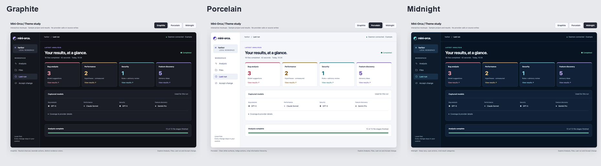

# Mini-Orca theme study

Open [the interactive mockups](index.html) in a browser. The gallery is self-contained
and works offline. All projects, models and findings shown are illustrative fixtures;
no actions call a provider, run project code or write source.

- **Graphite:** neutral charcoal surfaces, lavender primary actions and distinct category accents.
- **Porcelain:** light surfaces, indigo actions and darker semantic colors for readable contrast.
- **Midnight:** navy surfaces with cyan actions, keeping the same hierarchy and interaction model.

Use the page navigation to compare Analysis, Files, Last run and Accept change.
The icon model picker, file filter, theme switch and acceptance/Undo demonstration
are interactive. All three themes are available in the application through the
footer's **G**, **P** and **M** controls.

The real application retains exact captured provider metadata, consent, execution
trust, required checks, revision/source identity guards and guarded Undo. The mockups
illustrate presentation; the production browser tests verify the implemented flows.
