# Mini-Orca: next functions, fixes, and UI roadmap

Date: 2026-08-17  
Analyzed version: 4.1.0 (`f4371c5`)

## 1. Product direction

Mini-Orca should be a small, local-first coding IDE that helps a developer understand or change one bounded unit at a time:

> One active project → one selected file → one selected function/class → one reviewed change.

The project should not try to become a fully autonomous repository-wide coding agent. Its useful difference is focus, predictability, privacy, and a short review loop with a local model.

Recommended product rules:

1. Read-only actions may analyze one complete file.
2. Editing actions must name one target function, method, struct, interface, or class.
3. A generation may change only one file. The allowed scope must be visible before generation.
4. Imports may change only when required by the selected symbol, and this exception must be shown as `symbol + imports` in the UI.
5. Generated text is never written silently. The user sees a diff, checks, and an explicit Apply button.
6. Every request shows what context will be sent to the model and what was excluded.
7. Repository-wide features build an index, but model calls still process one file at a time.

### Desktop-only client decision

Mini-Orca will remove the HTMX web UI and keep Compose Desktop as its only user interface. The Go daemon remains the local API and LLM boundary, but it is no longer responsible for serving an IDE page or static web assets.

This reduces duplicated UI work and lets the product concentrate on a native, local workflow: project import, file/symbol selection, summaries, diff review, apply/undo, and local-model status all live in the desktop application.

Removal scope:

- remove web page routes, HTMX handlers, templates, static CSS/JavaScript, and web-only response caching after the desktop replacement is complete;
- remove obsolete web UI tests and documentation; keep REST API documentation for the desktop client and future integrations;
- move useful web behavior—file-tree navigation, loading/error states, chat history, and accessibility shortcuts—into Compose Desktop;
- retain `/health`, `/status`, project, generation, and future analysis APIs; these are desktop-client contracts, not browser routes;
- do not remove the web UI until the desktop app supports project import, file browsing, generation preview, errors, and connection status at least as well as the current web flow.

The rest of this roadmap treats the desktop app as the only product UI. References to the web UI below describe legacy code to remove, not a second interface to maintain.

## 2. What exists today

The current code already provides a useful foundation:

| Area | Current implementation | Important limitation |
|---|---|---|
| Project import | `POST /api/projects/import` scans a directory and writes `.mini-orca/analysis.md` | Available in the desktop client; needs re-analysis and lifecycle polish |
| Project context | File inventory plus bounded source snippets, with the selected file first | Context can include sensitive configuration and is byte-budgeted rather than token-budgeted |
| File explorer | Flat/filterable desktop file list | No symbol outline, status badges, ignore explanation, or summary state |
| File information | Language, size, line count, modification time, binary flag, and content | No semantic per-file summary or symbol list |
| Code generation | Requires `file_path` and `target_symbol`; returns a preview | Atomic scope is enforced only by the prompt, not by parsing the result or comparing a diff |
| Agents | Coder, tester, and reviewer code exists | The chat endpoint calls only the coder; the documented multi-phase/human-gate workflow is not wired into this UI flow |
| Web UI | Three-pane HTMX interface with file tree, file viewer, and chat | Legacy UI to remove after desktop reaches feature parity |
| Desktop UI | Import, project metrics, file view, and atomic generation | Generated output replaces the editor view as raw text; there is no diff, validation, Apply, or undo |
| Persistence | Project analysis is written to the imported project | Active state and chat history are memory-only and not scoped by project |

Relevant implementation locations:

- Project scan and analysis: `internal/project/analysis.go`
- Context construction: `internal/project/context.go`
- Atomic request handler: `internal/api/handlers/chat_handler.go`
- Atomic prompt: `internal/agent/orchestrator.go`
- Desktop UI: `desktop/src/main/kotlin/io/miniorca/desktop/Main.kt`
- Legacy web UI scheduled for removal: `internal/api/templates/`, `internal/api/static/`, and `internal/api/handlers/htmx_*.go`

## 3. Confirmed baseline

The following commands passed during this analysis:

```text
go test ./... -cover
go test -race ./...
go vet ./...
gradle -p desktop test
```

The desktop test task reports `NO-SOURCE`. Go coverage is good in several core packages, but it is 0% for `cmd/daemon`, `internal/api`, `internal/api/handlers`, `internal/errors`, and `internal/llm`. This means the current green result does not exercise routing, HTTP contracts, model failure behavior, or UI/API integration.

## 4. Fixes to make before adding major features

### P0 — Protect the atomic-edit promise

Current behavior: `RunCoderForSymbol` tells the model to return one complete file and preserve unrelated code, but the response is returned without structural validation.

Add a `GenerationValidator` that:

- accepts exactly one fenced code block or one structured response;
- rejects references to additional target files;
- parses the original and candidate file where a language parser is available;
- verifies that only the selected symbol and explicitly allowed imports changed;
- rejects missing, renamed, or duplicated target symbols;
- returns a structured diff and validation diagnostics;
- uses the original file hash to detect a file changed while generation was running.

Do not add Apply until this validator exists.

Acceptance criteria:

- A model response that edits a second function is rejected.
- A stale result cannot overwrite a newer file.
- Invalid syntax is shown as a failed preview, never as an applicable change.
- The UI states either `Strict symbol` or `Symbol + required imports` before generation.

### P0 — Add context privacy and exclusion rules

Current behavior: all recognized text/source extensions are context candidates. Files such as `config.yaml`, private key material with a recognized extension, generated sources, or large lockfiles may enter a prompt.

Add a central `ContextPolicy` used by project scan, analysis, file summaries, and generation:

- honor `.gitignore` plus `.mini-orcaignore`;
- deny common secret patterns: `.env*`, credentials, keys, certificates, tokens, and local config overrides;
- exclude generated/minified files and lockfiles by default;
- allow a per-project include/exclude configuration;
- show the exact included files, excluded files, estimated tokens, and truncation in a Context Inspector;
- require confirmation when the configured provider is not loopback/local;
- never log prompt bodies or credentials.

Acceptance criteria:

- A fixture containing `.env`, a private key, and `config.yaml` proves excluded content never reaches the fake LLM server.
- The user can see why a file was excluded.
- Context size is controlled by tokens, not only bytes.

### P0 — Pass cancellation and deadlines through the full call chain

Current behavior: the HTTP handler has a request context, but `RunCoderForSymbol` calls the agent with `context.Background()`.

Change the orchestration APIs to accept `context.Context` and propagate `r.Context()` to the LLM call. Do the same for tester/reviewer paths. A canceled UI request should stop the local-model request and release its resources.

### P1 — Make configuration real, not decorative

The daemon creates configured coder/tester/reviewer instances for logging, but the chat handler constructs a new coder with no configured skills. Per-agent model fields are parsed but not applied to the active generation path. There are also two orchestration layers (`internal/agent` and `internal/orchestrator`) with overlapping responsibilities.

Recommended fix:

- create one application service at startup and inject it into handlers;
- apply task/model profile, temperature, skills, retry policy, and timeout there;
- remove or clearly mark the unused orchestration path;
- add a `/api/models/current` response showing the effective—not merely configured—settings.

### P1 — Fix HTTP/UI contract drift

Current mismatches:

- `chat.js` can call `POST /api/chat/action`, but the daemon does not register it;
- JavaScript expects `#chat-phase-indicator`, but the template does not contain one;
- `docs/openapi.yaml` and `docs/api-contract.md` document session/gate routes that the daemon does not register;
- README claims coder → tester → reviewer → human gate, while `/api/chat/message` runs only the coder;
- release and Docker documents contain older version/configuration examples.

Choose one truthful workflow for v4.2 and update code, UI, OpenAPI, README, examples, and release notes together. Add a route-contract test that compares registered routes with the OpenAPI paths.

### P1 — Scope history and active state

Chat history is one process-wide slice. Importing another project does not create a new history, and restarting loses it.

Use lightweight project-scoped state under `.mini-orca/`:

```text
.mini-orca/
├── analysis.md
├── index.json
├── file-analysis/
└── sessions/
```

Every request should include a project revision/id. A response produced for revision A must not be applied after the UI switches to revision B.

### P1 — Add tests at the system boundary

Prioritize:

1. `httptest` route and error-contract tests for every live endpoint.
2. Fake OpenAI-compatible server tests for timeout, cancellation, empty choices, malformed JSON, non-200 responses, and oversized responses.
3. Concurrent import/generate/cache tests.
4. Desktop view-model/API-client tests without Compose rendering first.
5. One desktop smoke test: import → select file → analyze → generate → inspect diff.

Also fix `ResponseCache.Get`: it deletes expired entries while holding only an `RLock`. Add a race-focused expiration test or delete after acquiring the write lock.

### P2 — Clean the developer workflow

Improve the referenced `Makefile`:

- make `test` create `build/` before writing coverage;
- add `test-race`, `vet`, `check`, `desktop-test`, and `desktop-build` targets;
- make a local build use the host OS/architecture; reserve `linux/amd64` for a named release target;
- add all targets to `.PHONY`;
- use a Gradle wrapper so contributors do not need a compatible global Gradle installation;
- keep the version in one source and inject it at build time;
- make `check` run formatting verification, unit tests, race tests, vet, and desktop tests.

Example target layout:

```make
.PHONY: check test test-race vet desktop-test build build-linux

$(BUILD_DIR):
	@mkdir -p $@

test: | $(BUILD_DIR)
	$(GO) test ./... -coverprofile=$(BUILD_DIR)/coverage.out

check: test test-race vet desktop-test
```

## 5. Main new feature: analysis for every file

### Recommended behavior

Do not run a costly LLM request for every file during import. Build two layers:

1. A fast deterministic index for every eligible file during import.
2. A semantic local-model summary generated lazily for the currently selected file, one file per request.

This keeps import fast and preserves the product's one-file-at-a-time rule. An optional `Analyze all sequentially` command can fill the cache later, but it should be cancelable and visibly process files one by one.

### File analysis model

```go
type FileAnalysis struct {
    ProjectRevision string         `json:"project_revision"`
    Path            string         `json:"path"`
    ContentHash     string         `json:"content_hash"`
    Language        string         `json:"language"`
    Purpose         string         `json:"purpose"`
    Responsibilities []string      `json:"responsibilities"`
    Symbols         []SymbolInfo   `json:"symbols"`
    Imports         []string       `json:"imports"`
    Dependencies    []string       `json:"dependencies"`
    SideEffects     []string       `json:"side_effects"`
    Risks           []Finding      `json:"risks"`
    Suggestions     []Suggestion   `json:"suggestions"`
    Status          string         `json:"status"`
    Model           string         `json:"model,omitempty"`
    PromptVersion   string         `json:"prompt_version"`
    GeneratedAt     time.Time      `json:"generated_at"`
}
```

For each symbol, store name, kind, signature, start/end line, visibility, short purpose, and whether it is a valid atomic target. For the first release, use the Go parser for Go and a safe generic fallback for other languages. Add Kotlin/Java/TypeScript/Python/Rust extractors incrementally rather than pretending regex extraction is exact.

### Summary contents shown to the user

Each file page should answer:

- Why does this file exist?
- What are its public and important private symbols?
- What calls or imports does it depend on?
- What observable side effects does it have (disk, network, database, process execution)?
- What are the likely correctness/security/maintainability risks?
- Which small, atomic improvements are possible?
- Is the summary fresh for the current content hash?

AI findings must be labeled as suggestions, not facts. Deterministic facts (path, hash, imports, declarations, line ranges) should be visually separate from model interpretation.

### Storage and invalidation

Store an index in `.mini-orca/index.json` and cached semantic summaries under `.mini-orca/file-analysis/`, keyed by a hash of the normalized relative path. A cached entry is valid only when all of these match:

- content hash;
- analysis schema version;
- prompt version;
- selected model/profile;
- context-policy version.

Write cache files atomically with a temporary file plus rename. Do not put original source content in the cache.

### Proposed API

| Method and path | Purpose |
|---|---|
| `GET /api/projects/current/index` | Deterministic project/file/symbol index |
| `GET /api/projects/current/files/analysis?path=...` | Cached analysis or `status: missing/stale` |
| `POST /api/projects/current/files/analysis` | Analyze exactly one file |
| `DELETE /api/projects/current/files/analysis?path=...` | Clear one cached summary |
| `GET /api/projects/current/files/symbols?path=...` | Valid atomic targets with line ranges |
| `POST /api/projects/current/reindex` | Refresh deterministic facts without LLM calls |

Example request:

```json
{
  "path": "internal/project/context.go",
  "project_revision": "sha256:...",
  "refresh": false
}
```

Example concise response:

```json
{
  "path": "internal/project/context.go",
  "content_hash": "sha256:...",
  "status": "fresh",
  "purpose": "Builds bounded context for project analysis and focused generation.",
  "symbols": [
    {"name": "ContextBuilder.Build", "kind": "method", "start_line": 19, "end_line": 67}
  ],
  "side_effects": ["reads project files"],
  "risks": [
    {"severity": "medium", "summary": "Byte truncation can split UTF-8 or code fences."}
  ]
}
```

## 6. Other useful focused functions

### Must-have next

| Function | Scope | Result |
|---|---|---|
| Explain file | One file | Purpose, control flow, symbols, dependencies, and side effects |
| Explain symbol | One symbol | Plain-language behavior, inputs/outputs, edge cases, callers/callees |
| Find atomic targets | One file | Clickable function/class/struct list; removes manual symbol typing |
| Suggest small improvements | One file | Ranked cards, each already scoped to one symbol |
| Fix selected finding | One symbol | Validated candidate and diff |
| Refactor symbol | One symbol | Behavior-preserving candidate and diff |
| Add documentation | One symbol | Comment/docstring-only candidate |
| Generate test | One test symbol in one selected test file | Test-only candidate; never changes source and test files together |
| Validate candidate | One changed file | Format, parse, lint, and focused test output |
| Apply/undo | One validated file | Atomic write with backup and immediate undo |

### Useful later

- Impact preview using the deterministic index: files/symbols likely affected by changing the target.
- Prompt templates such as `Fix bug`, `Simplify`, `Add validation`, `Explain`, and `Write docs`.
- A context inspector showing token estimates and source snippets before Send.
- Local model health, loaded model, context-window, latency, and token-use indicators.
- Git diff/status badges, while keeping Git optional and read-only until Apply.
- Sequential `Analyze all` with pause/cancel/progress and no parallel LLM flooding.
- Compare two candidate generations for the same symbol.
- Export a focused review report as Markdown.

### Avoid for now

- autonomous multi-file refactors;
- background agents editing the repository;
- automatic commits or pushes;
- a plugin marketplace;
- repository-wide vector databases before the deterministic index is insufficient;
- multiple agents debating every small edit;
- a full text editor implementation before diff/apply safety is complete.

## 7. UI and graphics examples

### A. Recommended desktop layout

Use this information architecture in Compose Desktop.

```text
┌ MINI-ORCA  / mini-orca             Local ●  qwen-coder 7B   [Import] [⌘K] ┐
├──────────────────────┬──────────────────────────────────┬──────────────────┤
│ EXPLORER             │ context.go                  Go   │ FOCUSED ACTION   │
│ [Filter files…]      │ [Code] [Summary] [Changes]       │                  │
│                      │                                  │ Target           │
│ ▾ internal           │ Purpose                          │ [Build ▾]        │
│   ▾ project          │ Builds bounded context for       │                  │
│     analysis.go  ✓   │ project analysis and generation.│ Action           │
│     context.go   ●   │                                  │ [Fix issue ▾]     │
│     path.go      ✓   │ Symbols                          │                  │
│                      │ ▸ ContextBuilder.Build  L19–67   │ Request          │
│ Legend               │ ▸ listFiles             L69–94  │ [______________] │
│ ✓ summary fresh      │                                  │ [______________] │
│ ● summary stale      │ Findings                         │                  │
│ ○ not analyzed       │ ⚠ Byte truncation may split…    │ Scope            │
│                      │                                  │ 1 symbol + imports│
│                      │                                  │ [Generate preview]│
├──────────────────────┴──────────────────────────────────┴──────────────────┤
│ Connected ●  Context 18.4k / 32k  |  7 files included, 4 excluded  |  84ms │
└────────────────────────────────────────────────────────────────────────────┘
```

This preserves the current three-pane identity but changes the right panel from generic chat into a task form. Conversation can remain as a collapsible activity/history drawer.

### B. File Summary tab

```text
SUMMARY                                              Fresh · 2 minutes ago

Purpose
  Resolves project files safely and blocks path traversal.

Symbols (click one to use it as the target)
  [F] CanonicalRoot(path string)                 lines 12–34
  [F] ResolveFile(root, relative string)         lines 37–59
  [F] ResolvePathForWrite(root, relative string) lines 62–91

Dependencies       Side effects          Findings
  path/filepath      Filesystem reads      MEDIUM  TOCTOU window
  os                 Symlink resolution    LOW     Repeated root work

Suggested atomic tasks
  [Improve error typing] [Reduce repeated canonicalization] [Add race test]
```

Clicking a symbol should fill the target selector. Clicking a suggestion should fill the request but never send it automatically.

### C. Diff-first generation view

```text
CHANGE PREVIEW · ResolveFile                         Validation: 3/4 passed

Scope: internal/project/path.go → ResolveFile + imports
Base:  8b73…     Current: 8b73…     Candidate: 91fa…

  42    root, err := CanonicalRoot(root)
+ 43    if errors.Is(err, os.ErrNotExist) {
+ 44        return "", ErrProjectNotFound
+ 45    }

✓ One file       ✓ Target-only diff       ✓ Parses       ○ Tests not run

[Discard] [Ask for revision] [Run focused checks]                 [Apply]
```

Disable Apply until base hash, scope, parsing, and configured required checks pass. After Apply, replace it with `Undo` until the next mutation.

### D. Focused state flow

```mermaid
flowchart LR
    A[Import project] --> B[Build deterministic index]
    B --> C[Select one file]
    C --> D{User action}
    D -->|Analyze| E[Summarize one file]
    D -->|Edit| F[Select one symbol]
    E --> G[Show facts and suggestions]
    G --> F
    F --> H[Preview exact context and scope]
    H --> I[Generate candidate]
    I --> J[Validate target-only diff]
    J -->|Failed| K[Show diagnostics]
    J -->|Passed| L[Show diff]
    L -->|Apply| M[Atomic write]
    M --> N[Format and focused checks]
    N --> O[Undo available]
```



### E. Visual system improvements

Keep the current charcoal base and blue accent, but use color by meaning:

| Token | Suggested color | Use |
|---|---|---|
| Background | `#0D1117` | Editor canvas |
| Panel | `#161B22` | Explorer/action panels |
| Elevated | `#21262D` | Cards and selected rows |
| Border | `#30363D` | Dividers |
| Primary | `#F0F6FC` | Main text |
| Secondary | `#8B949E` | Metadata |
| Accent | `#2F81F7` | Primary action and selection |
| Success | `#3FB950` | Fresh/passed/local |
| Warning | `#D29922` | Stale/truncated/review needed |
| Error | `#F85149` | Invalid/failed/out-of-scope |

Additional UI guidance:

- Reserve purple for model-generated interpretation, blue for user actions, and green/red for verified state.
- Use icons plus text; do not communicate fresh/stale/error by color alone.
- Add resizable panes and remember widths locally.
- Add syntax highlighting before adding editing; the central pane can remain read-only initially.
- Use skeletons for file loading and a cancellable progress row for model calls instead of a full-screen overlay.
- Show exact active project path and model endpoint locality in the header.
- Provide keyboard navigation: `⌘P` file, `⌘⇧O` symbol, `⌘K` action, `⌘Enter` generate, `Esc` cancel.
- On narrow screens, turn Explorer and Focused Action into drawers rather than squeezing three panes.

## 8. Proposed implementation sequence

### Step 1 — Establish truthful contracts

- Decide whether v4.2 is a single-coder preview workflow or a real coder/tester/reviewer workflow.
- Remove dead UI calls and obsolete documentation.
- Define shared request/response schemas and regenerate/update OpenAPI.
- Inject one configured application service into HTTP handlers.

Exit condition: README, OpenAPI, registered routes, and visible UI describe the same behavior.

### Step 2 — Add safety foundations

- Implement `ContextPolicy`, ignore handling, token budgeting, and Context Inspector data.
- Propagate cancellation.
- Add project revision and file content hashes.
- Implement response extraction, scope validation, syntax parsing, and diff generation.
- Add HTTP/LLM/race tests.

Exit condition: untrusted model output cannot become an applicable out-of-scope or stale edit.

### Step 3 — Build the deterministic file index

- Add file hashes, language facts, imports, and symbol line ranges.
- Start with exact Go parsing and generic fallback.
- Persist `.mini-orca/index.json` atomically.
- Expose index and symbol APIs.

Exit condition: every eligible file has fast facts and supported files have clickable atomic targets without an LLM call.

### Step 4 — Add semantic per-file summaries

- Add the versioned `FileAnalysis` cache.
- Build a one-file prompt using file content, project summary, and only relevant signatures.
- Label deterministic facts and AI suggestions separately.
- Implement freshness, refresh, cancel, and sequential analyze-all behavior.

Exit condition: selecting any eligible file can show a cached or freshly generated summary, with stale state based on content hash.

### Step 5 — Upgrade the desktop UI around the focused workflow

- Add Code/Summary/Changes tabs.
- Replace free-text symbol input with a symbol picker while retaining manual fallback.
- Add suggestion cards, scope chip, context inspector, and cancellable progress.
- Render a structured side-by-side or unified diff.

Exit condition: import → select file → analyze → select symbol → generate → inspect diff works smoothly in the desktop application.

### Step 5a — Retire the web UI

- Confirm the Step 5 desktop workflow covers the current web UI's useful capabilities.
- Remove HTMX page routes, templates, static web assets, and web-only response cache wiring.
- Remove browser-specific UI dependencies and update Docker/README guidance so it no longer advertises an IDE at `localhost:9090`.
- Keep health/status and desktop API routes; restrict their CORS/network exposure to the local-machine deployment model.

Exit condition: the daemon starts without web assets or HTML routes, and the desktop client remains fully functional against its REST API.

### Step 6 — Add safe Apply and validation

- Require matching base hash and passed scope validation.
- Write with temp file + atomic rename and keep a recoverable backup.
- Run formatter/parser first, then a focused project check with an explicit command preview.
- Offer immediate Undo and record an audit entry.

Exit condition: Apply is explicit, recoverable, target-scoped, and cannot overwrite a concurrent edit.

### Step 7 — Extend language intelligence and polish

- Add parsers in this order based on actual users/projects, not the executor list alone.
- Add impact preview, Git badges, accessibility, keyboard workflow, and responsive drawers.
- Measure local-model latency, context size, cancellation success, validation failures, and cache hit rate locally.

## 9. Definition of done for the next milestone

A good v4.2 milestone is complete when:

- the desktop client can import and re-analyze a project;
- every eligible file has deterministic metadata and a fresh/stale/missing summary state;
- one selected file can be semantically summarized on demand;
- the user selects a real symbol rather than relying on free text;
- context exclusions and token estimates are visible;
- generation produces a structured, target-only diff;
- stale, multi-file, multi-symbol, or syntactically invalid candidates cannot be applied;
- Apply is explicit and Undo is available;
- HTTP contracts and model failure paths have automated tests;
- documentation describes only routes and workflows that are actually wired;
- the daemon contains no HTMX templates, static browser assets, or browser IDE routes.

This milestone would make Mini-Orca feel like a deliberate local coding instrument rather than a chat panel attached to a file browser, while keeping its scope intentionally smaller than a general autonomous IDE agent.
