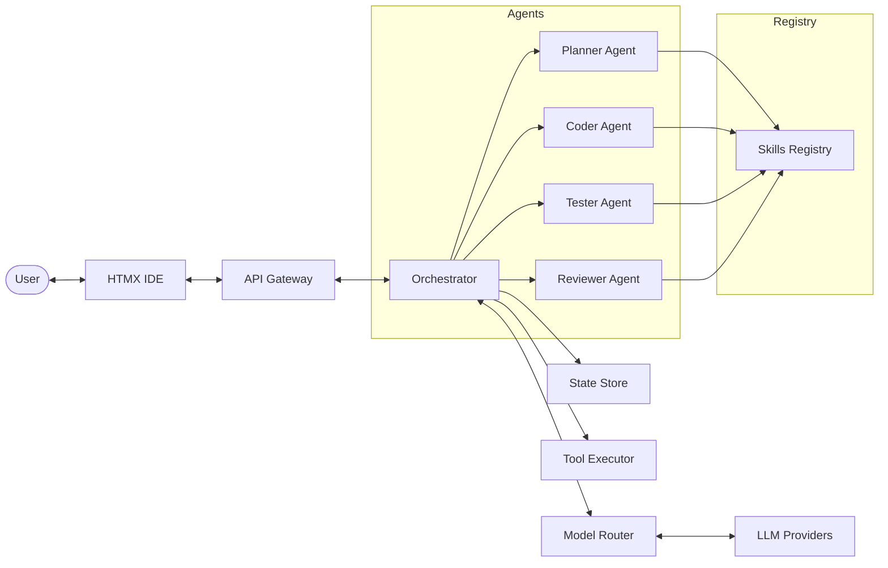

# mini-orca

**Version**: 2.0.0

Local agents orchestrator for mini tasks. Mini-Orca uses multiple specialized LLM agents to plan, code, test, and review your project tasks autonomously.

## Features

- **Multi-Agent Orchestration**: Specialized agents (Planner, Coder, Tester, Reviewer) work together to solve complex tasks.
- **Phase-Based Workflow**: Structured execution through Planning, Coding, Testing, and Review phases.
- **Human-in-the-loop**: Integrated human gate for approvals and feedback during the process.
- **HTMX-powered IDE**: A modern, responsive web interface for monitoring and interacting with agents.
- **Structured Logging**: Comprehensive JSON/Text logging with sensitive data redaction.
- **Robust Error Handling**: Centralized error management with user-friendly messages.
- **Extensible Skills**: Easily add new knowledge and tool skills to your agents via configuration.
- **LLM Provider Agnostic**: Supports multiple providers (e.g., LM Studio) with phase-specific model overrides.
- **Docker Support**: Containerized deployment with Docker and Docker Compose.

## Architecture



## Getting Started

### Prerequisites

- Go 1.22+
- LLM Provider (e.g., [LM Studio](https://lmstudio.ai/))

### Installation

1. Clone the repository:
   ```bash
   git clone https://github.com/nanaki-93/mini-orca.git
   cd mini-orca
   ```

2. Build the daemon:
   ```bash
   go build -o mini-orca-daemon ./cmd/daemon
   ```

3. Configure the application:
   ```bash
   cp config.example.yaml config.yaml
   # Edit config.yaml with your provider settings
   ```

### Running

Start the daemon:
```bash
./mini-orca-daemon
```

Access the IDE at `http://localhost:8080`.

### Docker

Run Mini-Orca with Docker:

```bash
# Build and run with Docker
make docker-build
make docker-run

# Or use docker-compose
docker compose up -d --build

# Access the IDE at http://localhost:8080
```

See [DOCKER.md](DOCKER.md) for detailed Docker documentation.

## Configuration

Configuration is managed via `config.yaml`. See [CONFIG.md](CONFIG.md) for a detailed reference and [config.example.yaml](config.example.yaml) for a full example.

## API Documentation

Detailed API information is available in [API.md](API.md).

## Docker Documentation

Docker setup and usage is documented in [DOCKER.md](DOCKER.md).

## Contributing

We welcome contributions! Please see [CONTRIBUTING.md](CONTRIBUTING.md) for guidelines.

## License

MIT

## Release Notes

See [RELEASE_NOTES.md](RELEASE_NOTES.md) for v2.0 release notes.
