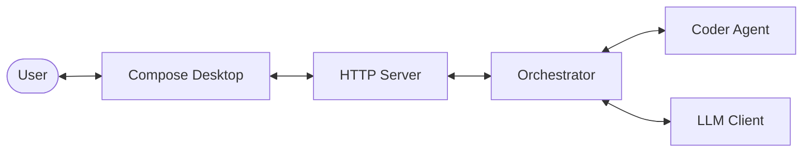

# mini-orca

**Version**: 4.1.0

Mini-Orca is a local-first desktop coding assistant for one deliberate change at a time: one active project, one selected file, one selected symbol, and one reviewed candidate.

## Features

- **Focused preview workflow**: A single configured coder produces a preview; focused checks are optional and Apply remains explicit.
- **Action modes**: `analyze_file`, `explain_symbol`, `fix`, `refactor`, `document`, and `generate_test`.
- **Visible scope modes**: `strict_symbol` changes one selected symbol; `symbol_plus_imports` additionally permits only required import changes.
- **No autonomous mutation**: No multi-file edits, automatic commits, or silent writes.
- **Existing Project Support**: Add features to any existing project by specifying its path.
- **AI Project Analysis**: Import a project to create a durable `.mini-orca/analysis.md` architecture summary and inventory.
- **Atomic Generation**: Generate exactly one named function or class in one selected file with project-wide context.
- **Compose Desktop client**: A native Kotlin desktop client for import, focused generation preview, and explicit review.
- **Structured Logging**: Comprehensive JSON/Text logging with sensitive data redaction.
- **Robust Error Handling**: Centralized error management with user-friendly messages.
- **Extensible Skills**: Easily add new knowledge and tool skills to your agents via configuration.
- **LLM Provider Agnostic**: Supports multiple providers (e.g., LM Studio, OpenAI-compatible APIs) with phase-specific model overrides.
- **Docker Support**: Containerized deployment with Docker and Docker Compose.

## Architecture



## Getting Started

### Prerequisites

- Go 1.22+
- LLM Provider (e.g., [LM Studio](https://lmstudio.ai/), OpenAI-compatible API)

### Installation

1. Clone the repository:
   ```bash
   git clone https://github.com/nanaki-93/mini-orca.git
   cd mini-orca
   ```

2. Build the daemon:
   ```bash
   go build -o mini-orca-daemon ./cmd/daemon
   ```

3. Configure the application:
   ```bash
   cp config.example.yaml config.yaml
   # Edit config.yaml with your provider settings
   ```

### Running

Start the daemon:
```bash
./mini-orca-daemon
```

The daemon exposes a loopback-only local API at `http://localhost:9090`; start the desktop client to use Mini-Orca. Container deployments must explicitly set `MINI_ORCA_BIND_ADDRESS=0.0.0.0:9090` when publishing the API port.

Or start the native desktop client in another terminal:

```bash
./desktop/gradlew -p desktop run
```

Use **Import project** in the desktop app. The daemon scans the selected directory, runs the AI architecture task, and writes `.mini-orca/analysis.md` into that project. See [Plan.md](Plan.md) for the implementation plan.

### Docker

Run Mini-Orca with Docker:

```bash
# Build and run with Docker
make docker-build
make docker-run

# Or use docker-compose
docker compose up -d --build

# The daemon exposes its local API on port 9090
```

See [DOCKER.md](DOCKER.md) for detailed Docker documentation.

### Creating a Session

Send a POST request to `/api/chat/message` with:
```json
{
  "message": "Validate email and return a typed error for invalid input",
  "file_path": "internal/user/service.go",
  "target_symbol": "UserService.Create"
}
```

### Workflow

1. Select one file and one function, method, type, interface, or class.
2. Choose a focused action. Candidate-producing actions require a target file and target symbol; `generate_test` requires a selected test file and test symbol.
3. Choose `strict_symbol` or, when required, `symbol_plus_imports`.
4. Review the generated preview. Generated code is never written automatically.

## Configuration

Configuration is managed via `config.yaml`. See [CONFIG.md](CONFIG.md) for a detailed reference and [config.example.yaml](config.example.yaml) for a full example.

## API Documentation

Detailed API information is available in [API.md](API.md).

## Docker Documentation

Docker setup and usage is documented in [DOCKER.md](DOCKER.md).

## Contributing

We welcome contributions! Please see [CONTRIBUTING.md](CONTRIBUTING.md) for guidelines.

## License

MIT

## Release Notes

See [RELEASE_NOTES.md](RELEASE_NOTES.md) for release notes.
