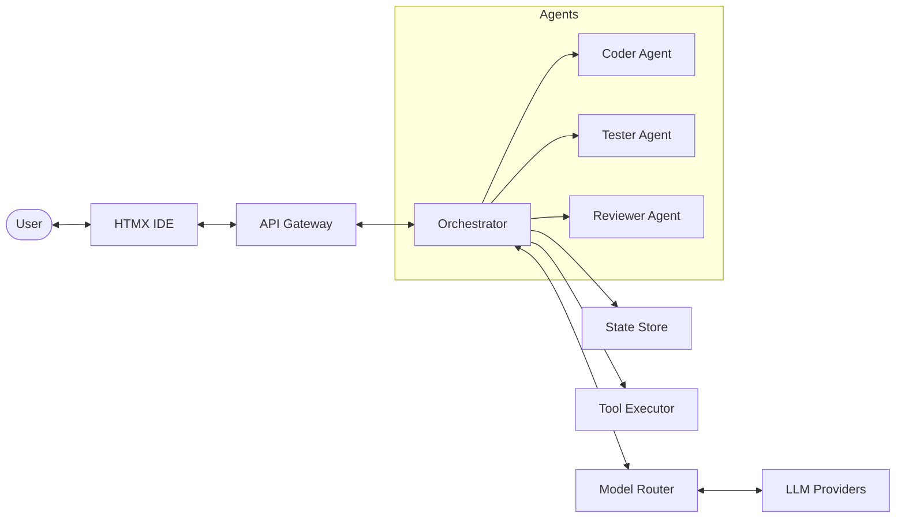

# Task 6.3: Update Documentation

## Goal
Update all documentation to reflect the new simplified workflow.

## Files to Modify
- `/Users/marcoandreose/DEV/lab/mini-orca/README.md`
- `/Users/marcoandreose/DEV/lab/mini-orca/API.md`
- `/Users/marcoandreose/DEV/lab/mini-orca/CONFIG.md`
- `/Users/marcoandreose/DEV/lab/mini-orca/RELEASE_NOTES.md`
- `/Users/marcoandreose/DEV/lab/mini-orca/config.example.yaml`
- `/Users/marcoandreose/DEV/lab/mini-orca/docs/api-contract.md`

## Detailed Steps

### Step 1: Update README.md
**Change the Features section:**

**From:**
```markdown
## Features
- **Multi-Agent Orchestration**: Specialized agents (Planner, Coder, Tester, Reviewer) work together...
- **Phase-Based Workflow**: Structured execution through Planning, Coding, Testing, and Review phases.
- **Human-in-the-loop**: Integrated human gate for approvals during the process.
```

**To:**
```markdown
## Features
- **Multi-Agent Orchestration**: Specialized agents (Coder, Tester, Reviewer) work together...
- **Simplified Workflow**: Single-feature workflow — code generation → test → review → human gate.
- **Human-in-the-loop**: Integrated human gate for final approval.
- **Existing Project Support**: Add features to any existing project by specifying its path.
```

**Update the Architecture diagram:**


**Update the Getting Started section:**
```markdown
### Creating a Session
Send a POST request to `/api/sessions` with:
```json
{
  "feature_request": "Add a function to calculate fibonacci numbers",
  "project_path": "/path/to/my/project",
  "project_type": "go"
}
```

### Workflow
1. **Coding**: Coder agent generates code based on your feature request
2. **Testing**: Tests are run on the generated code
3. **Review**: Reviewer agent reviews the code quality
4. **Human Gate**: You approve or request edits
```

### Step 2: Update API.md
**Update the Session Creation endpoint:**

**From:**
```markdown
### Create Session
POST /api/sessions
{
  "goal": "string",
  "project_path": "string",
  "project_type": "string"
}
```

**To:**
```markdown
### Create Session
POST /api/sessions
{
  "feature_request": "string - Natural language description of the feature to implement",
  "project_path": "string - Filesystem path to the existing project",
  "project_type": "string - Optional: 'go', 'python', etc."
}

Response:
{
  "id": "string",
  "feature_request": "string",
  "project_path": "string",
  "project_type": "string",
  "current_phase": "coding",
  "status": "pending",
  "created_at": "timestamp",
  "updated_at": "timestamp"
}
```

**Update the Session Lifecycle section:**

**From:**
```
Planning → Planning Review → Coding → Testing → Review → Human Review → Completed
```

**To:**
```
Coding → Testing → Review → Human Review → Completed
```

### Step 3: Update CONFIG.md
**Remove planning phase configuration:**

Search for and remove any references to:
- `planning` phase model overrides
- `planning_review` phase model overrides
- Planning-related agent skills

**Update the phases list to only show:**
- `coding`
- `testing`
- `review`
- `human_review`

### Step 4: Update RELEASE_NOTES.md
**Add v3.0 release notes:**
```markdown
## v3.0.0 — Simplified Workflow (2024-XX-XX)

### Breaking Changes
- Removed planning phase — sessions now start directly at coding
- Removed plan-driven execution — single feature request per session
- Removed `Plan`, `PlanUnit`, `AtomicUnit` data types
- Session creation now requires `feature_request` and `project_path`

### New Features
- Simplified 4-phase workflow: coding → testing → review → human_gate
- Direct feature request input instead of multi-step planning
- Support for adding features to existing projects

### API Changes
- `POST /api/sessions` now uses `feature_request` instead of `goal`
- Sessions start at `PhaseCoding` instead of `PhasePlanning`
- Removed planning-related endpoints
```

### Step 5: Update config.example.yaml
**Remove planning phase configuration:**

Search for and remove:
```yaml
phases:
  planning:
    model: "..."
  planning_review:
    model: "..."
```

### Step 6: Update docs/api-contract.md
**Apply the same changes as README.md and API.md.**

## Verification
- All markdown files updated
- No references to "planning phase" in documentation
- API examples use `feature_request` field
- Architecture diagram updated
- Release notes document the changes
